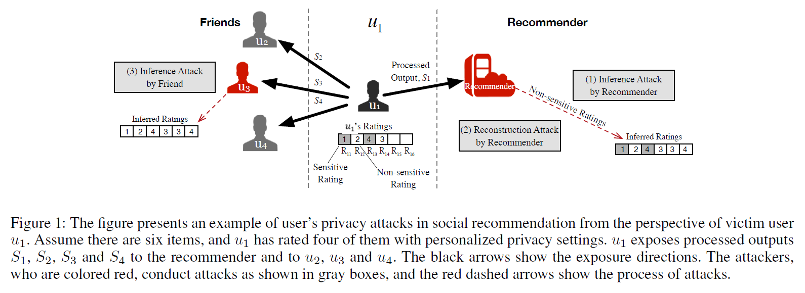
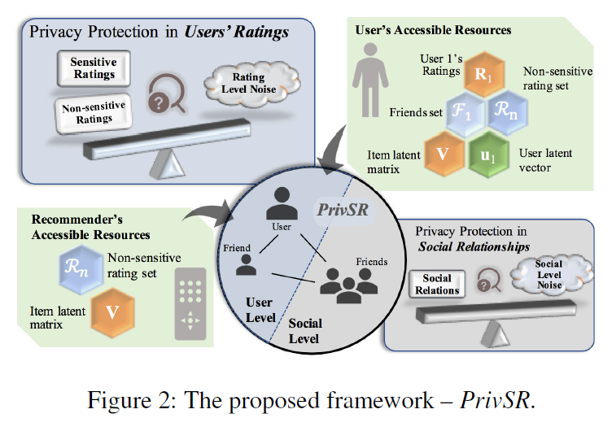
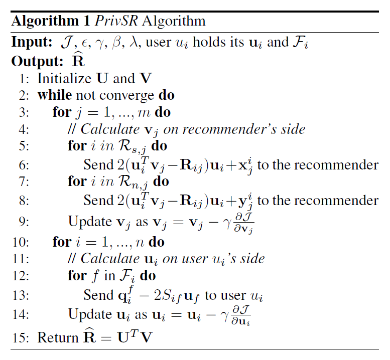

# PrivSR

> **Title**: Personalized Privacy-Preserving Social Recommendation

> **Authors**: Xuying Meng, Suhang Wang, Kai Shu, Jundong Li, Bo Chen, Huan Liu, Yujun Zhang

> **Institution**: Institute of Computing Technology, Chinese Academy of Sciences, Beijing, China; University of Chinese Academy of Sciences, Beijing, China; Computer Science and Engineering, Arizona State University, Tempe, USA; Department of Computer Science, Michigan Technological University, Houghton, USA

> **Conference**: AAAI Conference on Artificial Intelligence (AAAI)

> **Year**: 2018

### Topic

Differential privacy; Social recommendation

### Motivation

**Potential privacy leakage**:

- To update , the recommender requires user , who has rated item , to share  being calculated from rating  and user latent vector . However, when there is an item , on which  regards its  as non-sensitive and publishes it, the recommender can obtain  and , compute , and further obtain sensitive ratings  and ;

- With the exposed non-sensitive ratings, the recommender may conduct reconstruction attack to infer an approximation latent vector , by which 's all ratings may be disclosed;

- The malicious friend  requires user latent vector  for social regularization, by which  may learn 's ratings by computing .

**Privacy-preserving social recommendation problem**:

*Given the observed values in , the set of friends , a set of sensitive ratings , as well as a set of non-sensitive ratings , we want to infer the missing values in  without privacy leakage of .*

### Approach

- Divide the learning process of user latent vectors into small components for each specific user, and utilize objective perturbation to provide privacy guarantee under differential privacy.

- Divide the ratings into sensitive and non-sensitive ratings, and only attach sensitive ratings with small privacy budgets, i.e. big magnitude noises. In this way, the non-sensitive ratings' modeling will not be significantly affected, which can help retain recommendation effectiveness.

- Decouple the components of noise perturbation into small pieces each of which can be independently processed by individual users. In this way, each user can decide his/her own noise magnitude locally. The entire process can still satisfy the requirement of differential privacy.

### Contribution

- The first to study the problem of privacy-preserving social recommendation with personalized privacy.

### Performance

**Dataset**:

- [Ciao](http://www.ciao.co.uk/)

- [Epinions](http://www.epinions.com/)

**Comparative approach**:

- MF

- SoReg

- DPMF

**Metric**:

- Mean Absolute Error (MAE)
    - Recommendation effectiveness comparison
    - Privacy protection comparison
    - Impact of parameters  and 
    
**Question**:

[How to set the privacy budget of the derived item latent matrix?](https://github.com/WenyanLiu/apprenticeship/issues/1)
