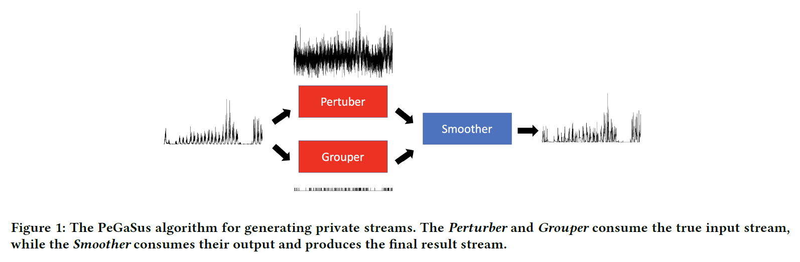
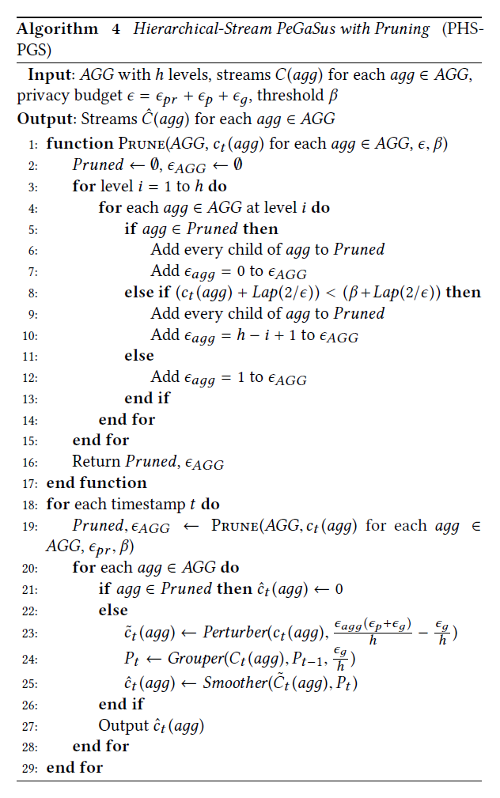

# PeGaSus

> **Title**: PeGaSus: Data-Adaptive Differentially Private Stream Processing

> **Authors**: Yan Chen, Ashwin Machanavajjhala, Michael Hay, Gerome Miklau

> **Institution**: Department of Computer Science, Duke University; Department of Computer Science, Colgate University; College of Computing and Information Sciences, University of Massachusetts Amherst

> **Conference**: ACM Conference on Computer and Communications Security (CCS)

> **Year**: 2017

### Topic

Differential privacy; Streaming data

### Motivation

Releasing continuous query answers on real time streams under differential privacy.

### Approach

*Perturb-Group-Smooth (PeGaSus)* based Stream Release:

- *Perturber*: consumes the input stream, adds noise to each incoming element of the stream, and generates a stream of noisy counts;

- Data-adaptive *Grouper*: consumes the input stream, identifies stable uniform regions in the stream and computes a partition of the data received so far;

- Query specific *Smoother*: performs post-processing, combines the output of the *Perturber* and *Grouper* to generate the final private estimate of a query answer at each time step.

***Perturber***:

Laplace Mechanism

_**Deviation-based Grouper (DBG)**_:

A differentially private method for online partitioning which chooses partitions that approximately minimizes a quality score based on deviation.

When a new data  arrives at time , we check the status of the last group  from the previous partition . If  is closed, we put  into a new open group and reset the noisy threshold. Otherwise, we compute the deviation of the  and compare a noisy version of the deviation value with the noisy threshold. If the noisy deviation is smaller than the noisy threshold, we add  into the open . Otherwise, we add a new group  into the partition and close both  and .

***Smoother***:

At each time step, it calls `PRUNE`. Then, for each aggregation, if it has been pruned. it simply outputs a count of 0. Otherwise, it applies the PeGaSus algorithm to the stream where the privacy budget passed to *Perturber* and *Grouper* is adjusted based on what has been pruned and the height of the tree.

The function `PRUNE` checks each aggregation  from level 1 to level . If the current  has been pruned, all its children are automatically pruned. Otherwise, we compare this aggregation's current count, (), against a user-specified threshold . If the count is below threshold, it prunes all the children of . Further, the privacy budget that would have been spent on the descendants is saved.

### Contribution

- Simultaneously support a range of query workloads over multiple resolutions over the stream

### Performance

**Dataset**: Real traces, taken over a six month period, from approximately 4000 WiFi access points (AP) distributed across the campus of a large educational institution.

**Baseline**:

- Laplace Mechanism (LM)

- Backward Smoothing of results from Laplace Mechanism (BS_t)

- Sliding Window query in terms of a fixed windows size  (SW_w)

**Metric**:

-  error

    - Answer unit counting queries on data streams with a single target state.
    
    - Answer sliding windows queries on data streams with a single target state.

- ROC curve

    - Event monitoring (detecting jumping and dropping points as well as low signal points) on data streams with a single target state.
    
    - Answer unit counting queries on a collection of hierarchical aggregations using data streams with multiple target states.