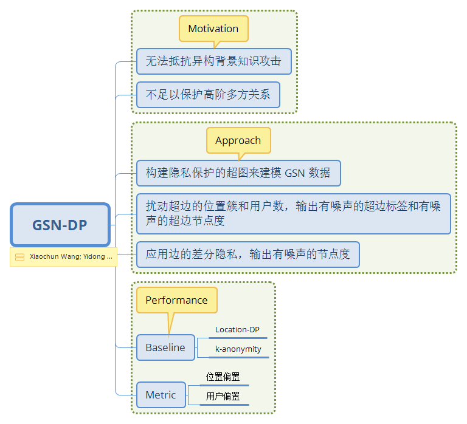

# GSN-DP

- **问题 1**　本工作如何保护社交网络中的多方关系？

　　（2.3 节）引入用户-用户间边的差分隐私，对用户社交的度的计数添加拉普拉斯噪声，保护一名用户与另一名用户间的关系。

- **问题 2**　本工作怎么解决地理社交网络图的高阶问题？

　　现有工作直接扰动每个地点用户的计数，本工作的主要优化是泛化生成超图，这张超图是用户-频繁访问地点-中心地点的三元组，最后扰动超边顶点的度。

- **问题 3**　算法 1 是采用了 Fuzzy 聚类来泛化超图的吗？

　　不是，（2.1 节）算法 1 采用的 baseline 聚类算法是 k-means。之所以算法的输出看起来像模糊聚类的结果，是因为超边上记录的是聚合的邻近频繁地点集。由于用户访问过多个地点，所以会与其他多个用户相连，但这不是模糊聚类导致的。

- **问题 4**　图 1 的说明性文字怎么与图中的定点和边对应起来？

　　（:warning:遗留问题）这个例子本应帮助理解算法的步骤，但是这张图把我弄糊涂了。超边 e1 的位置标签集应该是 {l1, l3} 吧？用户 v1 和 v2 应该由超边 e2 连接吧？他们应至少有 1 个访问地点属于 {l2, l5} 吧？

- **问题 5**　2.2 节中提到本工作防止两种隐私泄露：1) 位置是否包含在特定的位置区域中；2) 用户是否频繁访问特定位置区域。为什么要保护第一种位置隐私呢？

　　这两种隐私需要放在一起考虑。本工作发布的超图中，用户与位置区域关联，而位置区域是由多个位置组成的。所以，第一种位置隐私不是单纯地指某位置是否存在于某个区域中，这里的被保护的对象不是单个地点，而是该地点可能与用户关联，所以隐藏位置是否在区域中，间接保护了用户的访问隐私。

- **问题 6**　算法 2 隐私超图构建的第 3 行向聚类索引添加拉普拉斯噪声，为什么不用指数机制呢？

　　（:warning:遗留问题）保护聚类索引本质上保护的是一种标签，使用针对数值型的拉普拉斯机制，我觉得不太合适。此外，本工作中聚类索引的距离与实际地理位置的距离没有对应关系。

- **问题 7**　仍然是算法2 隐私超图构建的第 3 行向聚类索引添加拉普拉斯噪声，在真实世界中，发布有噪声的索引前要取整，这样还符合差分隐私的定义吗？

　　符合，仍然引入了不确定性。假设取整操作遵循四舍五入（上、下取整的情况是类似的）。

分析：根据实验结果，隐私预算从 0.1 到 1 不等，这里分析取极值时的情况。

当隐私预算分配 0.1 时，添加噪声 Lap[1/(0.1*0.5)]=Lap(20)，方差是 2*lambda^2=800，标准差是 sqrt(800)=28。那么，有噪声的索引不变的概率是 Pr[lap<0.5]=1-Pr[lap>0.5]=1-exp(-0.5/2)=0.2212；变为相邻索引的概率是 0.5276；变为相邻 3 内的索引的概率是 0.7135。

当隐私预算分配 0.1 时，添加噪声 Lap(2)，方差是 8，标准差是 2.8。那么，有噪声的索引不变的概率是 0.0247；变为相邻索引的概率是 0.0722；变为相邻 3 内的索引的概率是 0.1175。

- **问题 8**　超边节点度扰动后发布的 GSN 数据应该怎么做相应变换呢？是用户任意增加或删除与位置的关系吗？

　　（:warning:遗留问题）

- **问题 9**　为什么社交关系边差分隐私的敏感度是 1？

　　（:warning:遗留问题）反例：数据使用者查询所有用户的出度之和，而相邻数据集增加（或删除）一条用户间的超边，那么，在这样的情况中，有两名用户的出度同时 +1（或 -1），此时同一个查询的最大距离是 2，所以边差分隐私的敏感度应为 2。

